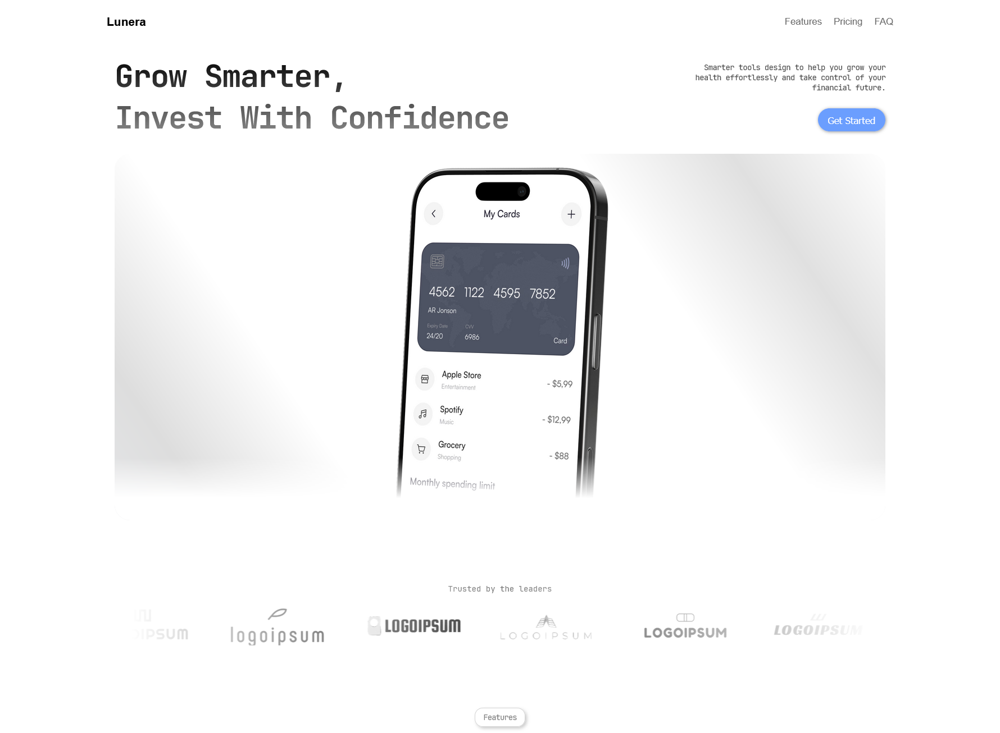

# React FAQ Page

This project is a front-end practice built with **React**.  
It focuses on **component design** and **UI animations**.

## Purpose

The goal of this project is to improve my understanding of React’s component architecture,  
state handling with `useState`, `useEffect`, `useRef`, and how interactivity can be enhanced using CSS transitions and animation libraries like **GSAP**.

It also serves as a playground for experimenting with **responsive layouts**, **semantic structure**, and **reusable components**.

## Features

- 🧩 Modular component structure (FAQ system)  
- 💫 Animated entrances using **GSAP** (planned for future updates)  
- 📱 Responsive design for different screen sizes  
- 🎨 Emphasis on visual rhythm and clean UI  

## Technologies

- **React (Vite)** – Component-based UI  
- **CSS Modules** – Scoped and maintainable styling  
- **GSAP** – Animation engine for motion experiments  
- **JavaScript (ES6+)** – Logic and interactivity

## Inspiration

Inspired by modern landing pages and micro-interaction design, this project explores how simplicity, hierarchy, and motion  
can enhance user experience in minimal web interfaces.

## Author

**Eduardo** – Front-end & Visual Developer in evolution 🚀  
Exploring **design**, **animation**, and **React development**.
